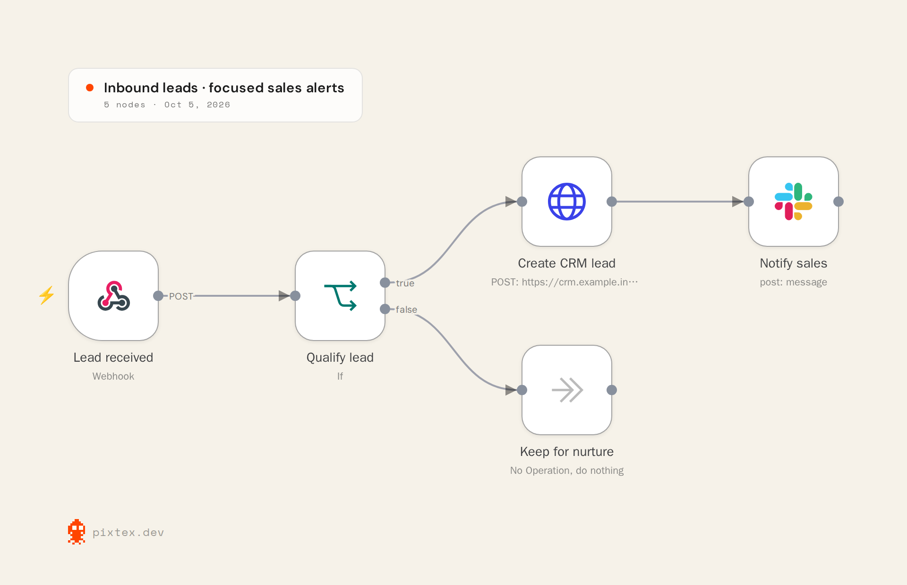

# One threshold change. Two branches to recheck.

A synthetic release example for an automation consultant handing a lead-routing change to a client.

[Try it in FlowDelta](https://blucca.github.io/flowdelta/) → **Try a lead-routing demo**.

## The request

“Sales is getting too many low-quality leads. Raise the qualification score from 60 to 75, and notify the sales channel after a qualifying lead has been written to the CRM.”

The exported change is small: one IF parameter, one Slack node and one connection. Repositioning the canvas adds no business change.

## The visual overview

Rendered from our [new-version JSON](after.json) with [Pixtex](https://pixtex.dev/), using its DOCS preset and 2× PNG export on 5 October 2026. The image is a structural overview; the acceptance table below specifies the behavior to verify. These sample workflows have placeholder services and have not been executed in n8n.

The diagram and the release packet use the same exported version: preserve both when handing a release to a client, so the visual explanation, checks and observed results refer to the same artifact.

## What the client needs to know

Leads scoring 60–74 switch from the CRM path to the nurture branch. Scores of 75 and above retain the CRM path and gain a downstream notification. The nurture node itself was not edited, but its input population changes; it belongs in the acceptance plan.

This is where a change list becomes a release handoff: explain the operational effect, then check both sides of the branch.

## Acceptance examples

These are **expected outcomes to test**, not completed executions. Configure the placeholder CRM endpoint and Slack channel in a test environment first.

| Numeric score | Previous route | New route | New sales notification |
| ---: | --- | --- | --- |
| 59 | Nurture | Nurture | None |
| 60 | CRM | Nurture | None |
| 61 | CRM | Nurture | None |
| 74 | CRM | Nurture | None |
| 75 | CRM | CRM | One after successful CRM write |
| 76 | CRM | CRM | One after successful CRM write |

Also try missing, null and string-valued scores against the intended validation policy. Cause a CRM failure and confirm the Slack step is not reached on the default stop-on-error path. Check the notification contents and destination with synthetic data.

The “Keep for nurture” demo node is a no-op marking the nonqualifying branch; it does not persist or send nurturing messages. Production nurturing behavior belongs to the real workflow's implementation.

## The handoff

Download the [generated release packet](release-handoff.md), add your delivery owner and business explanation, and record actual test inputs and observations. All checks in the sample start **NOT RUN**.

This demo was created for FlowDelta. It is not a customer project or a revenue case study.
